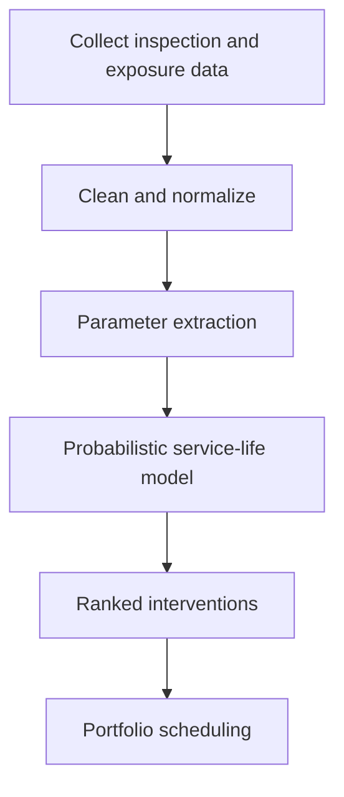

Infrastructure decisions move faster when the evidence is easy to see. This post outlines how we turn inspection data
into visual outputs that explain risk, uncertainty, and timing.

## What we visualize

1. **Exposure intensity** across assets and locations
2. **Corrosion rate trajectories** over time
3. **Service-life envelopes** at P10 / P50 / P90
4. **Intervention timing trade-offs** for life-cycle cost

## Example: corrosion rate trend

The chart below is a simple example of how a time series can highlight accelerating deterioration and justify early
intervention.



## Example: decision flow

## What makes a visualization decision-ready

- **Uncertainty is explicit** (ranges, not single points)
- **Assumptions are visible** (exposure class, cover, materials)
- **Actions are linked** (what changes if the data shifts)

If you want a specific visualization for your asset class, share the data structure you have and we will propose the
most useful views.
