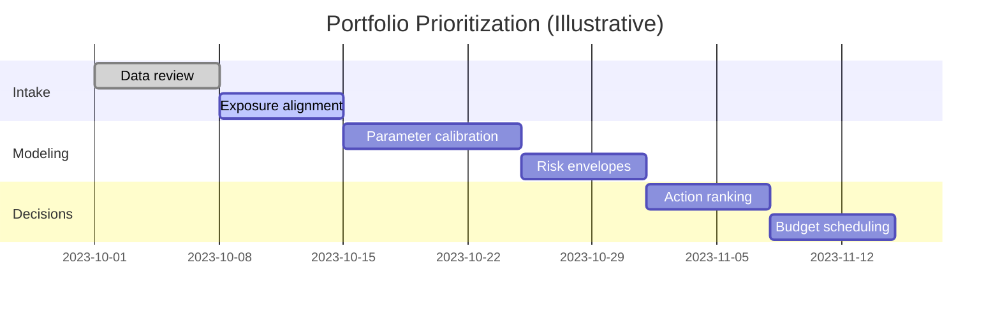

When resources are limited, the question is not whether to intervene but **where and when**. A portfolio approach ties
probabilistic risk to budget and operational constraints.

## A simple prioritization workflow

## Ranking criteria that hold up in review

- Probability of corrosion initiation and propagation
- Consequence of failure and service disruption
- Timing sensitivity (cost escalation vs delay)
- Exposure severity and uncertainty

## Output formats clients prefer

- Ranked asset list with thresholds and triggers
- Scenario tables for do-nothing vs intervention
- Portfolio map of exposure classes and risk tiers

If you want us to adapt this to your asset classes (bridges, marine structures, industrial plants), share a sample
inventory and we will outline a tailored approach.
