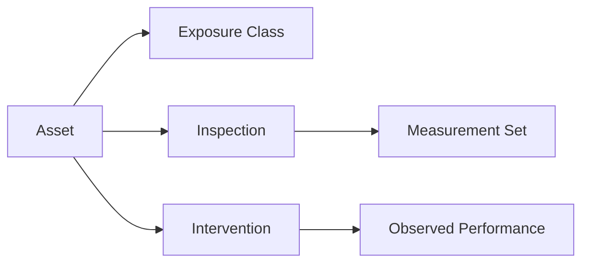

Long-lived infrastructure needs long-lived knowledge. A durability knowledge base keeps inspection results, exposure
classes, and intervention outcomes structured so the next decision is faster and more defensible.

## What to capture

- Asset identity: location, geometry, materials, service requirements
- Exposure profile: chloride, carbonation, moisture, temperature, microclimate
- Inspection history: dates, methods, findings, data quality notes
- Intervention history: treatments, repairs, cost, performance

## A practical structure

## Why it matters

- **Consistency**: the same assumptions can be reused across years
- **Traceability**: every decision is tied back to data sources
- **Speed**: new analyses are lighter when the data is clean

If you need help defining the schema for your assets, we can provide a starter template and data dictionary.
